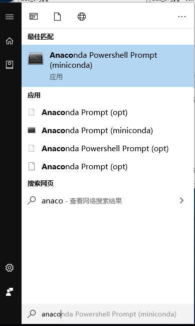
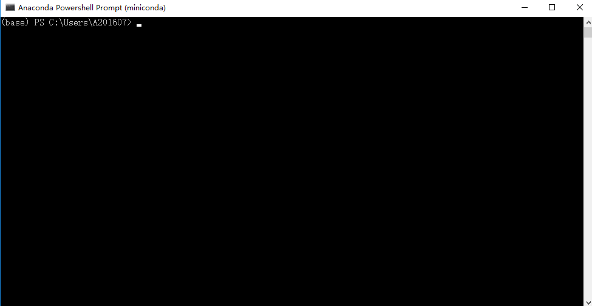
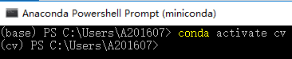
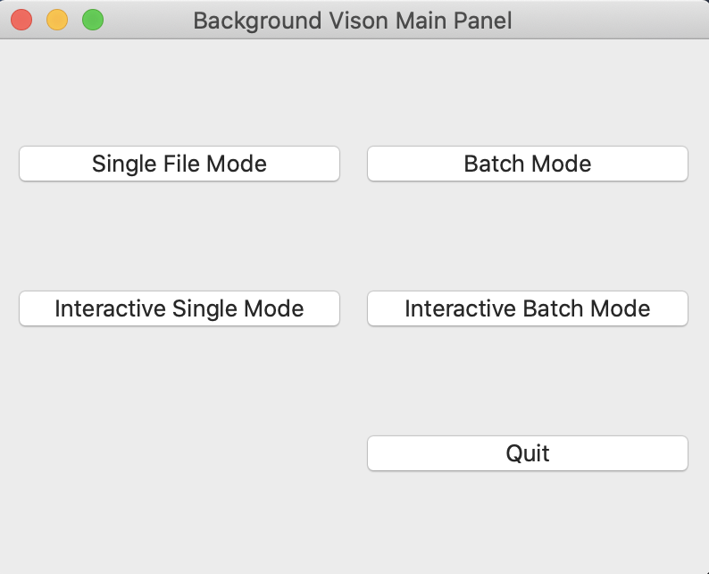
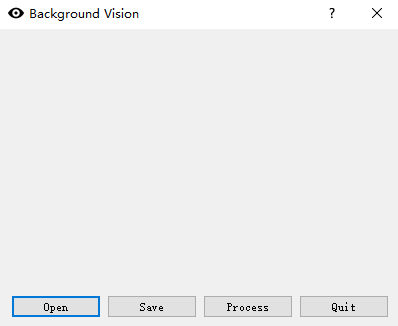
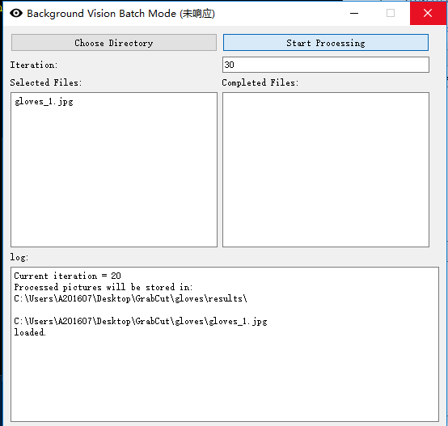

# 建议Iteration设置

| 种类 | Interactive Mode Iteration | Batch Mode Iteration |
| :--: | :------------------------: | :------------------: |
| 帽子 |                            |          10          |
| 手套 |                            |     Unavailable      |
| 围巾 |                            |     Unavailable      |

# 各模式综述

### Single File Mode

### Batch Mode

### Interactive Single Mode

# 如何启动程序（Windows）

1. 点击Windows桌面左下角的`开始`按钮

2. 搜索`anaconda PowerShell Prompt (miniconda)`

1. 点击搜索得到的`anaconda PowerShell Prompt (miniconda)`， 进入如下界面

1. 输入命令`conda activate cv`，若出现如下界面则命令输入正确，关键是光标所在行的开头为`(cv)`

5. 运行程序
   * 方法一：
     1. 输入命令`python `，注意python后面下、必须要加空格
     2. 打开桌面上的`GrabCut`文件夹，将`main`拖入`Anaconda PowerShell Prompt`
     3. 键入回车键
   * 方法二：
     1. 输入命令` python C:\Users\A201607\Desktop\GrabCut\main.py`
     2. 键入回车

6. 若操作无误，应该出现以下界面

7. 点击按钮`Single File Mode`，会进入如下界面

* 该模式一次只能处理一张图片
* `Open`按钮会打开一个文件选择界面，从中选择一张图片即可在主界面中显示出来
* `Save`按钮会打开一个文件保存界面，选择一个文件夹来保存图片
* `Process`按钮会自动扣图
  * 该过程需要3～4分钟，请耐心等待
  * 不要多次点击`Process`按钮，否则程序会重复处理同一张图片
  * 过程中光标会变成圆环
  * 当光标复原，或`Anaconda PowerShell Prompt`中出现`Process Completed`时，图片处理完成
* `quit`会退出`Single File Mode`

1. 点击按钮`Batch Mode`，会进入如下界面

* `Choose Directory `会
  * 打开一个文件夹选择界面，选择需要批处理的图片所在的文件夹
  * 选择完文件夹后，会在所选文件夹下创建一个名为`results`的文件夹
  * 若`results`文件夹原本存在，则会**删除原文件夹及其包含的所有文件**，再创建一个新的、空的`results`文件夹
* `Start Processing` 会开始处理所选的图片
* `Iteration` 设置算法的循环次数
  * 输入数值后，键入回车键，以设置循环次数
  * 设置成功后，会在`log`中显示`Current iteration = newIterationTimes `
* `Selected Files` 会显示所选目录下可以处理的图片的名字
* `log` 会显示程序的执行情况，包括
  * 处理完成的图片所在的保存文件夹
  * 图片已经被读入程序
  * 图片已经被处理完成
  * 图片已经被保存
* `Completed Files`，会显示已经保存的图片名字及其总的处理时间